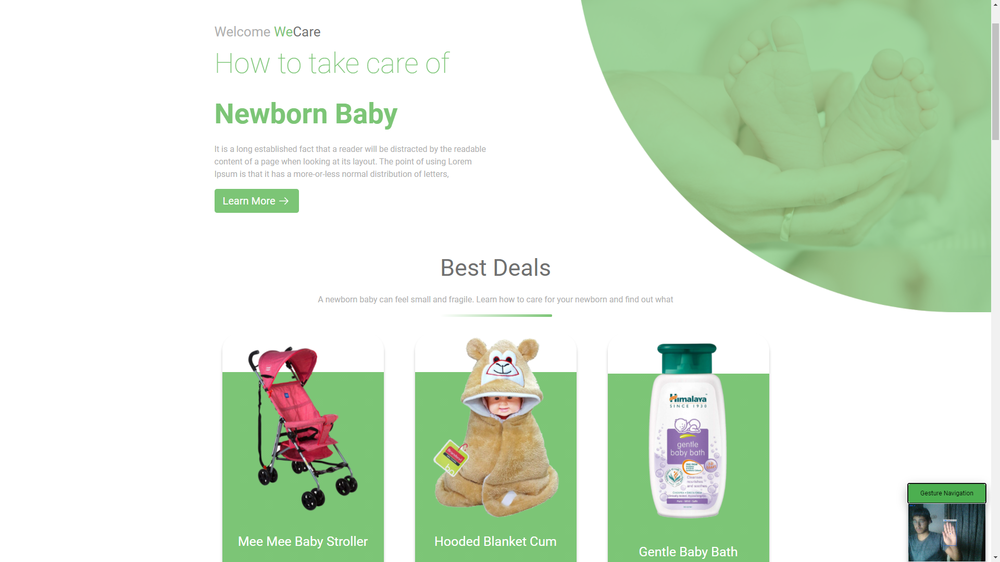
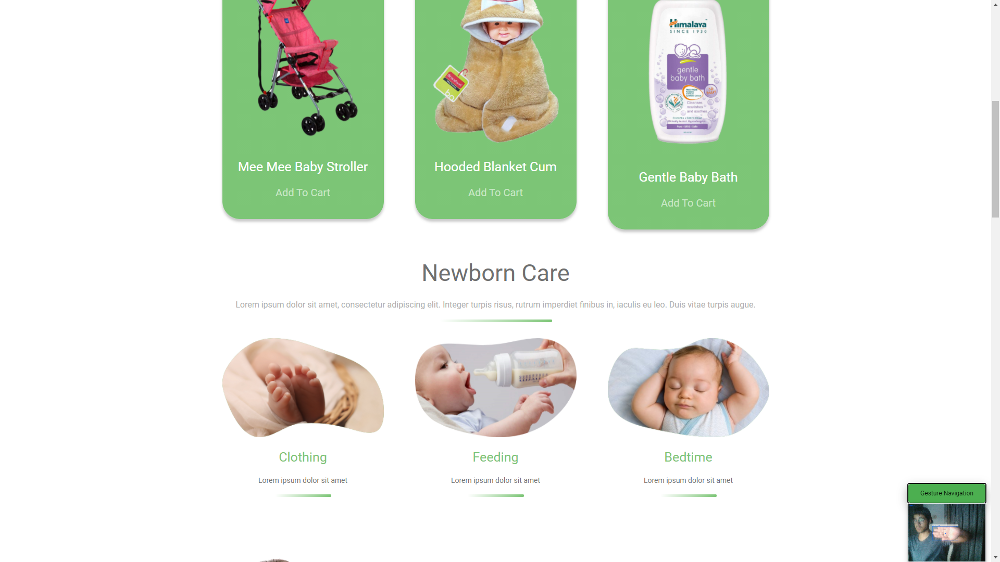

# We Care

Basic Layout project but with a try on Gesture Navigation: So we need to take a step into touchless user experience in our products (Mobile Apps and websites).

Using <strong>handtrackjs</strong>, the camera, once enabled will track the user's hand's orientation, if the hand is facing up, it will scroll upwards and if the hand's orientation is either rotated to the right or left, the page will scroll downwards.

### Going Up:

### Going Down:

### Link: https://we-caare.netlify.app/

#### How to contribute
All contributions are welcome.